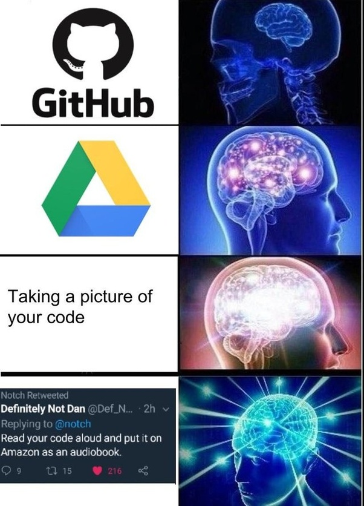

# JS Piscine

# FE 03

## Basic rules

* The Node.JS version used by JS Piscine is LTS 14.x.
* The questions are arranged in ascending order of difficulty.
* Your code will be evaluated through peer review, so please make it **easy for others to read**! (For example, naming variables meaningfully or naming functions according to their functions.)
* For the problem of implementing a function, the function is imported through the module upon evaluation. Therefore, you need to export the function code to be submitted.
  - If there is only one function to be implemented, `default export` must be processed.
* Modules related to development such as **nodemon** and **ESlint** must be defined in `devdependencies`.
* Before proceeding with the evaluation, install all the prerequisite modules through the `npm install` command.
* Unnecessary files like `node_modules` should be properly excluded via `.gitignore`.
* We do not evaluate the code format, but it is recommended to proceed while checking the code format through eslint or beautify.
* **RTFM!!**
* Subjects can be changed up to 1 hour before the submission deadline.
* If you find an error (a typo or logical error) in the issue, please register the issue in the [github repository] (https://github.com/42js/piscine). Your help makes JS Piscine more perfect :)

## FE 03 - Your Own Issue Tracker

| | |
| --------------------:| ------------------ |
| Folder name to submit: | fe03 |
| File name to be submitted: | no limit |
| Available external modules: | no limit |
| Note: | None |

 

<h2 align="middle">Your own issue tracker</h2>

Make your own issue tracker with React and Github v3 API.

> Libraries/frameworks are not limited and free. However, the reason for using a library/framework must be convincing.

> A conformable UI/UX should be configured.

## Implement the function

- You can search for a specific repository.
- Issues in the searched repository can be displayed as a list.
- You can create/edit/delete issues.
- Issue function
  - You can designate/delete the person in charge.
  - You can create/edit/edit comments.
  - You can create/edit/delete labels.
  - You can lock/unlock comments.
  - You can close or open issues.
- You can display a list of issues and labels with infinite scrolling.
- You can pin issues at the top.
  - Pin issues can be changed in card order with `drag and drop`.
- All actions should be reflected directly on the page without refreshing.
- Using the Github v3 API, the contents applied on the page are applied to the actual Github.
- Error handling for Github v3 API is required.

> Look for design patterns like `presentation container pattern`.

## bonus

- Select one of 'throttling' and 'debouncing' to apply infinite scrolling.
- Even if you refresh, the previous search history remains.
- You can create/edit/delete milestones.
  - Milestones can be listed with infinite scrolling.
- You can save up to 3 search terms.
  - The search query should be maintained even when the browser is closed.
- There is an alternate image for every blank page.
- Apply `Skeleton UI`.
- Implemented using CSS preprocessor.
- Support dark mode.
  - Dark mode must be supported through input.
  - The input type is checkbox.
  
> https://docs.github.com/en/rest